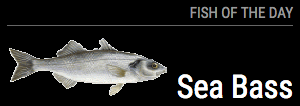

# MMM-Fish


This is a module for the [MagicMirror](https://github.com/MichMich/MagicMirror/tree/develop). This module shows the fish of the day.

## Installation
1. Navigate into your MagicMirror's `modules` folder and execute `git clone https://github.com/nigel-daniels/MMM-Fish`.  A new folder `MMM-Fish` will appear.

## Config
The entry in `config.js` has only one option. 
You can change between English (default) and German names. 

Here is an example of an entry in `config.js`
```
{
    module:		'MMM-Fish',
    header:		'Fish of the Day',
    position:	'top_left',
    config: {
        language: 'german'
    }
},
```

## Notes
I was asked if we could have a fish of the day ^_^

## Thanks To...
- [Michael Teeuw](https://github.com/MichMich) for the [MagicMirror2](https://github.com/MichMich/MagicMirror/tree/develop) framework that made this module possible.
